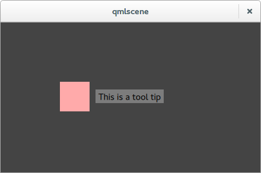

# QML ToolTip

A simple tooltip system for qml.

## Usage

An example is provided in `main.qml`. It can be run with the command:

    qmlviewer main.qml

Attach a ToolTipArea to each container you want to have a tooltip.

A message can be specified by using the text property of ToolTipArea.

## Examples

Simplest:

    Rectangle{
        width: 50
        height: 50
        color: "#ffaaaa"
        ToolTipArea{
            text: "This is a tool tip"
        }
    }

Custom placement:

    Rectangle{
        id: thingWithToolTip
        width: 50
        height: 50
        color: "#ffaaaa"
        ToolTipArea{
            tip {
                text: "This is a tool tip"
                x: thingWithToolTip.width + 10
                y: thingWithToolTip.height/2 - tip.height/2
            }
        }
    }

Custom delay and placment:

    Rectangle{
        id: thingWithToolTip
        width: 50
        height: 50
        color: "#aaaaff"
        ToolTipArea{
            showDelay: 0
            hideDelay: 1000
            tip {
                text: "This is a tool tip"
                x: thingWithToolTip.width + 10
                y: thingWithToolTip.height/2 - tip.height/2
            }
        }
    }

## License (zlib)

Copyright (c) 2014 Johan Klokkhammer Helsing

This software is provided 'as-is', without any express or implied
warranty. In no event will the authors be held liable for any damages
arising from the use of this software.

Permission is granted to anyone to use this software for any purpose,
	   including commercial applications, and to alter it and redistribute it
	   freely, subject to the following restrictions:

	   1. The origin of this software must not be misrepresented; you must not
	   claim that you wrote the original software. If you use this software
	   in a product, an acknowledgment in the product documentation would be
	   appreciated but is not required.

	   2. Altered source versions must be plainly marked as such, and must not be
	   misrepresented as being the original software.

	   3. This notice may not be removed or altered from any source
	   distribution.
